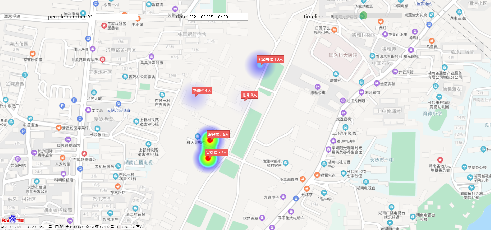

### 项目描述

基于百度地图实现疫情期间学院上班人员不同时段的热力图可视化，具体到某一时刻学院五座大楼的人数可视化。

可以根据时间轴显示不同时间的人员情况，并显示当前时刻的总人数

附：



### 运行项目

+ 使用vscode，安装Live Server插件，运行baidu.html

+ 注意：需要自己申请百度API的开放密钥：http://lbsyun.baidu.com/apiconsole/key#。来替换下面代码中ak的xxxxxx。

```js
<script type="text/javascript" src="https://api.map.baidu.com/api?v=2.0&ak=xxxxxx"></script>
```
